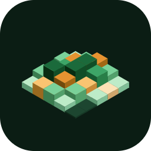

<div align="center">



# Clack

**Your daily input, drawn as a calendar.**

A local-only desktop app that records keyboard and mouse activity, one day at a time.

[](LICENSE)
[](#system-requirements)
[](https://tauri.app)
[](https://www.rust-lang.org)

[**📥 Download latest**](https://github.com/YOUR-USERNAME/clack/releases/latest) ・ [Website](https://YOUR-USERNAME.github.io/clack/) ・ [日本語](README.md) / **English**

</div>

---

## Table of contents

- [Overview](#overview)
- [Features](#features)
- [Download](#download) (Windows / macOS)
- [Screenshots](#screenshots)
- [Usage](#usage)
- [Privacy](#privacy)
- [Data format](#data-format)
- [Building from source](#building-from-source)
- [Stack](#stack)
- [Architecture](#architecture)
- [Contributing / License](#contributing)

---

## Overview

Clack records the number of keyboard and mouse interactions **per day** and visualizes them as a GitHub-style contribution heatmap.

- 🟢 **Fully offline** — zero network calls. All data stays on your device.
- 🟢 **Lightweight** — ~5 MB binary, minimal memory. Designed to live in the tray 24/7.
- 🟢 **Cross-platform** — Windows 10 / 11 and macOS 10.15+ (Intel / Apple Silicon).
- 🟢 **Open source** — MIT-licensed, all code is public.

---

## Features

### 📅 Record

| Feature | Details |
| --- | --- |
| Calendar heatmap | One cell per day, 5-level color grading. Switch between 1 / 3 / 6 / 12 months. |
| List view | Date, key count, mouse count in tabular form. |
| Monthly total | Always visible in the footer. |
| Idle exclusion | Pause counting after configurable seconds of no input (default 60 s). |
| Auto-repeat suppression | A held key counts only once until released. |

### 📊 Analyze

| Feature | Details |
| --- | --- |
| Key / mouse breakdown | Top 30 most-pressed keys as a horizontal bar chart. |
| Hour heatmap | Activity by hour-of-day in 24 cells. |
| Streak | Consecutive days with input, ending today. |
| Best day | The most active day across the entire history. |
| Scope toggle | Today / Last 7 / This month / All time, one click. |

### ⚡ Live overlay

| Feature | Details |
| --- | --- |
| Real-time chips | Pressed keys appear instantly in a tiny always-on-top window. |
| Modifier combos | `Shift + 1` and friends collapse into a single chip. |
| Stack mode | Keep up to 100 recent chips, or fade after 3.5 s. |
| Drag-anywhere | Move the overlay freely. Translucent glass styling. |

### 💾 Backup

| Feature | Details |
| --- | --- |
| JSON export | Complete envelope with data + settings, perfect for backups. |
| CSV export | `date,keys,mouse,total,h0..h23` — ready for spreadsheets. |
| JSON import | Restore from backup with a two-step confirmation. |
| Delete all | Clear all stored data with confirm + toast. |

### 🛠 Other

| Feature | Details |
| --- | --- |
| Tray-resident | Close button hides; the app stays in the tray until you quit. |
| Autostart | Launch with the OS, minimized. Opt-in. |
| Pause | Temporarily stop counting (resets at restart). |
| Bilingual UI | English / 日本語 switch. |
| Light / Dark / Auto theme | |

---

## Download

→ [**Latest release**](https://github.com/YOUR-USERNAME/clack/releases/latest)

### Windows

| Format | File | When to use |
| --- | --- | --- |
| **NSIS installer** | `Clack_x.x.x_x64-setup.exe` | Standard Windows install. |
| **MSI installer** | `Clack_x.x.x_x64_en-US.msi` | Enterprise / GPO deployment. |
| **Portable** | `clack.exe` + `WebView2Loader.dll` | No install, run from any folder. |

### macOS

| Format | File | When to use |
| --- | --- | --- |
| **Universal DMG** | `Clack_x.x.x_universal.dmg` | Intel + Apple Silicon, single download. |

### System requirements

| OS | Requirements |
| --- | --- |
| Windows | 10 / 11 (x86_64), WebView2 Runtime (built into Windows 11) |
| macOS | 10.15 Catalina or later (Intel or Apple Silicon) |

> **🟡 Windows: SmartScreen warning**
> The binary is unsigned, so Windows Defender SmartScreen will warn on first launch. Click **More info → Run anyway**.

> **🟡 macOS: Gatekeeper warning + Input Monitoring permission**
> Unsigned `.app` will show "cannot be opened because the developer cannot be verified". **Right-click → Open** the first time, then click Open in the dialog.
> Then open System Settings → **Privacy & Security → Input Monitoring** and **Accessibility**, and enable Clack in both places. On macOS, global keyboard monitoring may require both.

### macOS installation steps (detailed)

1. Download the `.dmg`, open it, drag `Clack.app` into `Applications`.
2. **Right-click** `Clack.app` → Open → click Open in the dialog (first time only).
3. System Settings → Privacy & Security → Input Monitoring → enable Clack.
4. If needed, also enable Clack under Accessibility.
5. Restart the app. Done.

---

## Screenshots

<div align="center">

<!-- Add real screenshots under screenshots/ and update paths -->

| Main (calendar) | Analytics |
| --- | --- |
|  |  |

| Live overlay | Settings |
| --- | --- |
|  |  |

</div>

---

## Usage

### First launch

Double-click to start. The main window opens.
On subsequent launches the app **stays in the tray** — interact via left-click or the right-click menu.

### Tray menu

| Item | Behavior |
| --- | --- |
| Open window | Show the main window. |
| Pause | Temporarily stop counting (reset on restart). |
| Live display | Toggle the floating live overlay. |
| Autostart | Launch with the OS. |
| Settings… | Open the settings window. |
| Quit | Final flush + exit the process. |

### Keyboard shortcuts (settings window)

| Key | Action |
| --- | --- |
| `Esc` | Cancel |
| `Ctrl + Enter` | Save |

---

## Privacy

> ### **Zero network calls.**
>
> The source contains no HTTP / TCP libraries.
> There is no structural path for your data to leave the device.

### What is recorded

✅ Per-key press counts (e.g. `KeyA = 1234`, `Space = 567`)
✅ Mouse button (left / middle / right) click counts
✅ Hour-of-day activity buckets (0–23)
✅ Daily aggregates

### What is NOT recorded

❌ The text you type or passwords
❌ Order or timing of keystrokes
❌ Active window titles or app names
❌ Screenshots or screen contents
❌ Device info, IP addresses, accounts

### Where data lives

| OS | Path |
| --- | --- |
| Windows | `%APPDATA%\Clack\data.json`<br>`%APPDATA%\Clack\settings.json` |
| macOS | `~/Library/Application Support/Clack/data.json`<br>`~/Library/Application Support/Clack/settings.json` |

You can verify this yourself: `grep -r "http" src-tauri/src` returns zero matches.

---

## Data format

Example `data.json`:

```json
{
  "2026-05-15": {
    "keys": 8742,
    "mouse": 1124,
    "keyBreakdown": { "KeyA": 312, "Space": 421, "Return": 88 },
    "mouseBreakdown": { "Left": 980, "Right": 124, "Middle": 20 },
    "hourly": [0, 0, 0, 12, 88, 145, 410, 622, 803, ...]
  }
}
```

CSV export columns:

```
date,keys,mouse,total,h0,h1,h2,...,h23
2026-05-15,8742,1124,9866,0,0,0,12,88,...
```

---

## Building from source

See **[RUN.md](RUN.md)** for the full guide. Quick start:

```sh
git clone https://github.com/YOUR-USERNAME/clack.git
cd clack
npm install
npm run build              # OS-specific artifacts
```

| OS | Artifacts |
| --- | --- |
| Windows | `clack.exe` + `WebView2Loader.dll` + `Clack_*_x64-setup.exe` + `Clack_*_x64_en-US.msi` |
| macOS | `Clack_*_aarch64.dmg` / `Clack_*_universal.dmg` |

All artifacts are collected into **`dist/`**.

### Distribution (auto-build for both OSes)

Push a tag `v*.*.*` and GitHub Actions builds both installers and attaches them to a Release. See **[公開手順.md](公開手順.md) §4** (Japanese).

```sh
git tag v0.1.0
git push --follow-tags
# In 10–15 minutes the .exe / .msi / .dmg appear in Releases.
```

---

## Stack

| Layer | Choice | Role |
| --- | --- | --- |
| Shell | [Tauri 2](https://tauri.app) | Desktop integration, window mgmt, IPC |
| Renderer | OS-native (Win: WebView2 / Mac: WKWebView) | UI rendering |
| Backend | [Rust](https://www.rust-lang.org) | Counting, state, persistence |
| Input hook | [rdev 0.5](https://github.com/Narsil/rdev) | OS-level keyboard / mouse events (cross-platform) |
| Time | [time 0.3](https://github.com/time-rs/time) | Local date / time |
| Persistence | serde + JSON | Atomic write (tmp → rename) |
| Frontend | Vanilla JS + CSS | No framework dependency |
| Autostart | tauri-plugin-autostart | Win: registry / Mac: LaunchAgent |
| Dialog | tauri-plugin-dialog | Native OS file pickers |
| Single instance | tauri-plugin-single-instance | Launch lock |
| Bundling | tauri-bundler | Win: NSIS / MSI ・ Mac: .app / .dmg |

---

## Architecture

```
                     ┌──────────────────────────┐
   OS input events   │  rdev listener thread    │
   (kbd / mouse) ──→ │  handle_event             │
                     └──────┬───────────────────┘
                            │  Mutex<AppState>
                            ▼
       ┌───────────────────────────────────────────┐
       │  AppState                                  │
       │   today_stats / history / hourly / ...     │
       └──┬─────────────────────────────────────┬───┘
          │                                     │
   ┌──────▼─────────┐                  ┌────────▼────────┐
   │ flush (10s)    │                  │ rollover (30s)  │
   │ writes data.json│                 │ date change     │
   └────────────────┘                  └─────────────────┘
                            │
                            ▼
                  ┌──────────────────────┐
                  │  WebView (JS UI)     │
                  │  invoke / listen     │
                  └──────────────────────┘
```

---

## Contributing

- Bug reports / feature requests: please open an [issue](https://github.com/YOUR-USERNAME/clack/issues).
- Pull requests are welcome.
- Coding conventions: see the security note at the top of `src/main.js`, and `Cargo.toml`'s `lints` block for Rust.

---

## License

[MIT License](LICENSE) © Clack contributors

---

## Acknowledgments

- [Tauri](https://tauri.app) — the thin Rust + WebView shell
- [rdev](https://github.com/Narsil/rdev) — cross-platform input hooking
- Inspired by the GitHub Contribution Graph

---

<div align="center">

[⬆ Back to top](#clack)

</div>
